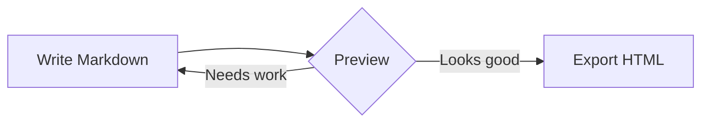
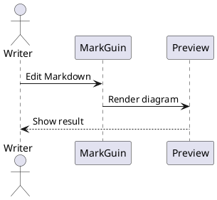

# Diagram preview

## Mermaid flowchart

```mermaid
flowchart LR
    Idea[Write Markdown] --> Preview{Preview}
    Preview -->|Looks good| Export[Export HTML]
    Preview -->|Needs work| Idea
```

## PlantUML sequence

```plantuml
@startuml
actor Writer
participant MarkGuin
participant Preview
Writer -> MarkGuin: Edit Markdown
MarkGuin -> Preview: Render diagram
Preview --> Writer: Show result
@enduml
```
